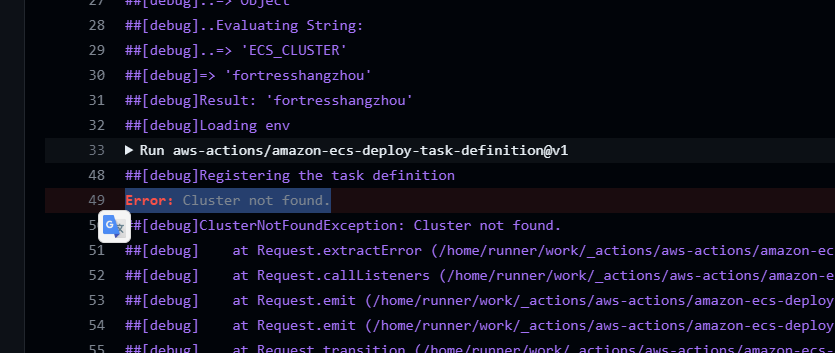
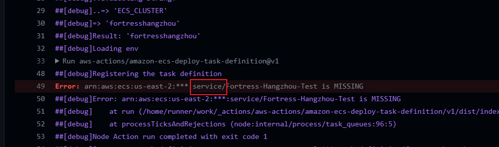

## docker

### 1. 构建docker 镜像
docker build -t test .

### 2. 查看docker 镜像
docker image ls

### 3. 运行docker 镜像
docker run 

## 验证AWS ECR中的image，在本地是否可以运行
### 1. 先pull到本地
```
// 1. 登录aws
 aws ecr get-login-password --region us-east-2 | docker login --username AWS --password-stdin 298117917676.dkr.ecr.us-east-2.amazonaws.com
 // 2. docker pull 298117917676.dkr.ecr.us-east-2.amazonaws.com/fortress-hangzhou-dev:latest
```

## 在部署到ecs的时候
### 1. 代码中.aws文件夹下定义的taskdefinition.json会自动部署到ecs的task definition中，名称就是.json文件中的family 
### 2. ECS_CLUSTER
需要先创建yaml中的ECS_CLUSTER，否则

### 3. ECS Service
因为执行github action的时候，提示Error: arn:aws:ecs:us-east-2:***:service/Fortress-Hangzhou-Test is MISSING
所以我在aws上的ECS cluster上建立了一个service


 #### 创建ECS 坑
 1. need to creat sg for both ecs service and ALB
### 4. ECS Service部署成功，然后去github的action执行，部署到ecs的yaml
### 5. 部署成功后在日志组中发现数据库链接失败, 因为没有数据库创建
### 6. 创建RDS数据库，记录用户名/密码/数据库名到env，然后重新触发git action
// todo 
1. ci 数据库 access deny问题
2. 部署到ecs

